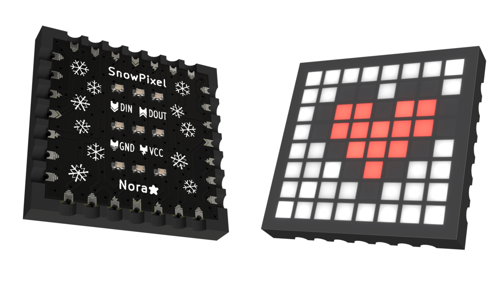

# SnowPixel
Yet another 8x8 neopixel matrix... But hear me out, this one is a little special ❄️ 

This is a small 20x20x1.3mm module that can be seamlessly tiled without any wiring by soldering them together with the castellated holes.  
The built in solder jumpers in the data pads let the user decide whether the module sends and receives the data straight accross or at a 90 degree angle making any configuration possible.

The modules are meant to be used standalone or as an smd component in and of itself.  
The leds used are XL-1010RGBC-WS2812B 1x1mm leds which are the smallest currently available.  
This project is meant mainly as a test to push the pcb fab's specs to the limit and try a couple 3D printing ideas to obtain a thin, seamless display.

## 3D print
The 3D printed case is what brings the SnowPixel to life giving it proper square pixels. There's a standalone version for generic use and an smd version for when the pcb is soldered directly on a bigger pcb.  

The STL folder contains a bunch of common configurations, but the models are fully modular and can be easily edited with the OpenSCAD files.  

I'm currently experimenting with two methods for diffusing the light.  

### PET
These models are meant to be printed with PET (not PETG) on a PET diffusion film substrate.
This can be done by modifying a little the G-code to add an offset equal to the thickness of the film.

### PLA
These models are much simpler to print, they can be printed with normal pla (or any other plastic really) and only need the first layer to be printed in white and the rest in black.

 > Not an amazing render, I will update it with proper photos soon

## Manufacturing update
Even if quite out of spec for JLCPCB's cheapest offering (not paying for castellated holes and definitely going over spec for both the copper and silkscreen layers) the boards all turned out mostly fine!  
They definitely needed some cleanup as the edges were filled with burs from the castellated holes and the LED silkscreen wasn't printed all the way around.  
The boards are otherwise perfectly functional and pretty simple to assemble by hand with an hotplate.

#### Todo for v1.2
- [ ] Modify data jumpers for easier operation. (Maybe cuttable traces?)
- [ ] Make leds silkscreen thicker.
